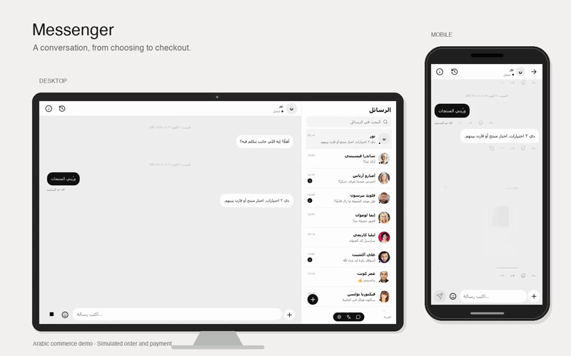

# React Messenger — Next.js

A modernized version of [sejr/react-messenger](https://github.com/sejr/react-messenger), retaining the original Messenger-inspired layout, reusable components, and grouped message bubbles. The original Git history and MIT license are preserved.

## Demo video

[](assets/demo/device-showcase.mp4)

Watch the full recording: [Device showcase (30 seconds)](assets/demo/device-showcase.mp4) · [Mobile](assets/demo/mobile-commerce.mp4) · [Desktop](assets/demo/desktop-commerce.mp4).

The showcase places the real desktop and mobile recordings inside device frames. Click the preview to open the full video.

Recorded from the working application: browse electronics, choose storage and multiple colors, select delivery and extras, enter sample customer details, review an order, and complete simulated payment. The walkthrough uses Arabic UI, fictional products, and demo mode. No real purchase or payment occurs. Both desktop and mobile walkthrough checks passed.

Recording details and chapter timestamps: [demo assets](assets/demo/README.md). Re-record with `npm run build` followed by `npm run record:demo -- --workers=1`.

## Run locally

Use Node.js 24.21.0 (`.nvmrc` included) and npm 12.2.0. Node.js 24.15.0–24.x or 26+ is required by npm 12.

```sh
npm ci
npm run dev
```

Open http://localhost:3000. For production:

```sh
npm run build
npm start
```

`npm start` now runs the Next.js production server; use `npm run dev` for development. Deploy using any Node.js host that supports Next.js. No environment variables or external accounts are required for demo mode. Live assistant mode is optional and requires the server settings below.

## What changed

- Create React App and `react-scripts` replaced with the Next.js App Router and Turbopack.
- React 16 replaced with React 19.3.0; Next.js 16.3.8 installed. Direct runtime packages use the latest stable npm versions checked on October 3, 2026.
- Axios and runtime Random User API requests replaced with bundled demo contacts and local portraits, so the page can render on the server and run without a third-party API connection.
- Moment replaced with native `Date` arithmetic and `Intl.DateTimeFormat`. UTC timestamps render consistently during server rendering and hydration.
- Shave DOM mutation replaced with CSS ellipsis. The old Ionicons CDN font replaced with locally bundled Lucide SVG icons.
- Obsolete ReactDOM initialization, CRA service worker, public HTML template, and stale Yarn lockfile removed. npm is the canonical package manager; `package-lock.json` has been regenerated.
- Next.js metadata, manifest, optimized local contact images, accessible buttons, focus indicators, and native modal dialogs added.
- Sidebar and messages scroll independently. The composer stays within the message panel. On narrow screens, select a conversation and use the back button to return to the list.

## Messenger features

- English and Arabic UI, an instant language switch, RTL layout, localized timestamps, and automatic direction for mixed-language messages and drafts.
- A mobile composer that follows `visualViewport.height` and `offsetTop` when the keyboard opens or pans the page. Safe-area padding, dynamic viewport fallback, 16px inputs, and support for browser pinch zoom are retained.
- Connection status from browser online/offline events. New messages queue in memory while offline and resume once on reconnection.
- Sample online/away contact presence, animated typing, and sending/sent/delivered/read receipts. These people-chat states and replies are disclosed as simulations in Settings and conversation information.
- Multiline composition (Enter sends, Shift + Enter adds a line), IME-safe Enter handling, bilingual emoji search, quoted replies, emoji reactions, and a jump-to-latest control.
- Image attachments under 5 MB (JPG, PNG, WebP, GIF), a removable draft thumbnail, a separate image viewer, 100–300% zoom, and download.
- Custom polls with 2–5 distinct options and one changeable local vote. Polls, presence, and media previews are separate reusable components.
- Animated assistant typing and streamed text, Stop, partial-response retention, retryable errors, copy, and natural clarification questions. Reduced-motion preferences are respected.

Messages, attachments, poll votes, product choices, and new contacts are saved in this browser using IndexedDB. Storage failures are shown in Settings, with a session-only fallback. Restoration keeps the most recent 500 messages per conversation. People chats do not deliver anything to another person. No calling, accounts or multi-user delivery service is implemented. Assistant transcripts also have a server-side SQLite demo archive, described below. The included contact names and portraits are sample data.

## Optional real AI provider

The assistant starts in **Demo** mode with language-aware sample replies. They are deterministic examples, not generated reasoning; demo mode does not inspect photo contents.

For a real assistant, copy `.env.example` to `.env.local` and set `AGENT_BACKEND=openai` and configure both values:

```dotenv
AGENT_BACKEND=openai
OPENAI_API_KEY=your_server_api_key
OPENAI_MODEL=a_responses_api_model_available_to_your_account
```

Restart the server. The UI reads `/api/agent` to report the connection mode in conversation information; live mode requires both values. The selected model is entirely under your control; choose a vision-capable model to process photos. Do not put either value in a `NEXT_PUBLIC_` variable.

`POST /api/agent` accepts `{ locale, messages: [{ id?, role: 'user' | 'assistant', text, image? }] }` and returns newline-delimited JSON events: `mode`, `delta`, `card`, `reference`, `done`, or `error`. The transport uses [OpenAI's Responses streaming API](https://developers.openai.com/api/docs/guides/streaming-responses) and its [image input format](https://developers.openai.com/api/docs/guides/images-vision), with `store: false`, a bounded transcript, and a 60-second timeout. Client cancellation aborts the upstream request. Failures stay visible and retryable; they never silently fall back to a sample answer.

The provider receives up to 20 eligible messages (40,000 text characters), the latest two user images, stable message IDs, quoted/forwarded source references, and product-choice context. An older latest product choice is reserved as a compact memory entry when it falls outside the recent-message window. Provider credentials stay on the server. In live mode, assistant-chat content and included images are sent to the configured provider. People chats stay local. **Add application authentication and rate limiting before exposing a keyed endpoint publicly.** This workspace preview listens on loopback and uses demo mode.

The live adapter is verified with mocked upstream streams, including provider errors and cancellation. No paid request or account/model availability check was performed.

## Structure for future agents and developers

See `AGENTS.md` for the codebase guide. The immutable reducer is in `src/lib/chat-state.ts`; orchestration is in `src/hooks/useMessenger.ts`. Provider and stream-framing code are separate from rendering. `src/components/` contains the composer, emoji picker, poll composer/card, message actions, media viewer, and presence indicator. English/Arabic strings live in `src/lib/i18n.ts`.

## Validation

```sh
npm run check
npx playwright install chromium webkit
npm run test:e2e
npm audit --omit=dev
```

`npm run check` combines linting, unit tests, and the production build. Browser tests run against a production server on port 3127 with provider keys disabled. They cover desktop Chromium, mobile Chromium, and mobile WebKit: search, separate histories, hydrated rendering, sending, photos, previews, polls, votes, replies, reactions, emoji, Arabic/RTL, offline/reconnect queues, assistant streaming, cancellation/retry, IME composition, reduced motion, product carousel indexing, comparison, independent storage/color messages and delivery/extras dialogs, forwarding/source navigation, and memory across reloads.

Keyboard tests focus the composer, shrink the viewport, and simulate separate visual-viewport height and top-offset changes. These verify keyboard layout behavior in browser automation; **a physical iOS/Android keyboard was not tested**.

Unit tests cover message-group boundaries, immutable state updates, poll validation, bounded provider input, UTF-8 framing across stream chunks, cancellation, errors, route validation, product methods, presentation tools, memory restoration, and retained choice context. The latest run passed lint/build, 26 unit tests, and 56 browser tests; the desktop-only inapplicable mobile keyboard case is skipped.

To record the customer-selection flow during verification, run `RECORD_DEMO_VIDEO=1 npm run test:e2e -- --project=desktop -g 'electronics choices use separate'`. The recording is written under `test-results/`; recording is disabled by default.

## Dependency compatibility and audit

Next.js and React are pinned to the latest stable versions available during this migration; the lockfile fixes transitive versions too. ESLint is pinned to **9.39.5**, the latest compatible 9.x release: Next.js 16.3.8’s React/import/accessibility plugins still declare ESLint 9 peer ranges, and ESLint 10.12.0 failed with `scopeManager.addGlobals is not a function`. ESLint 9 is now out of upstream support; update it when Next.js’s bundled lint plugins support ESLint 10.

The production audit reports **zero vulnerabilities**. The full audit currently reports **five high-severity entries** stemming from one unpatched development-only `braces` advisory through Next.js’s ESLint plugin (`fast-glob → micromatch → braces`). The [upstream advisory](https://github.com/advisories/GHSA-vfj7-8cjw-p6xm) lists no patched release. These packages are lint tooling, not production dependencies. Do not use `npm audit fix --force`, which proposes downgrading the Next.js ESLint configuration to version 14.2.35.

## Source and license

Original project by Sam Roth, based on commit `09922cd`. The MIT license is retained in `LICENSE`. Demo portraits were obtained from Random User (`https://randomuser.me/api/portraits/`); their source URLs are listed in `public/avatars/SOURCES.md`.

This is an independent Messenger-inspired demo and is not affiliated with Meta/Facebook.

## Messages design

The chat uses the supplied monochrome reference: compact rows with timestamps and unread counts, black outgoing bubbles, white incoming bubbles, a floating new-chat button, and a small bottom navigation bar. The automated contact is named Noor (نور in Arabic), with no separate AI section, sparkle decoration, starter cards, or follow-up cards. Its automated identity and current demo/provider mode are disclosed in conversation information and Settings. Demo letter requests ask about the recipient and purpose before showing a scripted draft. Polls are available from More options in all conversations; votes are local and single-user.

The requested unslop runner was attempted with 20 visual samples and stopped before generation because Claude Code is not authenticated. The accompanying design profile is a manual review of the existing UI and supplied reference, not a statistical profile generated from 20 model outputs.

## Interactive electronics mockup

In Noor’s conversation, choose **More options → Browse products**, or send “Show me the electronics”. The catalog contains three fictional products with sample USD prices and generated studio images. This is a UI composition, not a vendor catalog, live inventory, cart checkout, payment flow, or ordering service.

Each role has its own component and method:

| Role                                    | Component                                        | Method                                    |
| --------------------------------------- | ------------------------------------------------ | ----------------------------------------- |
| Horizontal product collection           | `Products/ProductStrip`                          | `showProducts`                            |
| Compare selected cards                  | `Products/ComparisonCard`                        | `compareProducts`                         |
| Color swatches and variant text | `Products/ColorOptions` / `ProductOptionsDialog` | `selectProduct`                           |
| Delivery radios                         | `ChoiceDialog` in single mode                    | `chooseDelivery`                          |
| Extras checkboxes                       | `ChoiceDialog` in multiple mode                  | `chooseExtras`                            |
| Review and save selection               | `Products/SelectionCard`                         | `confirmSelection`                        |
| Poll creation and voting                | `PollComposer` / `PollCard`                      | Independent poll actions                  |
| Forward a message or card               | `ForwardDialog`                                  | Send a new message with source provenance |

Selections continue the conversation as new messages, with immutable snapshots so earlier choices remain readable. Every message has a stable ID, available under Message details. Forwarding creates a new ID, keeps the original conversation/message IDs, opens the destination conversation, and provides a link back to the source. The provider transcript includes these references as context. Natural demo questions such as “What did I choose?” recall the latest selected product and offer a link to its message.

Live provider requests expose validated presentation functions for product lists, comparisons, multiple chat messages, and references to IDs in the supplied transcript. The implementation follows the [official OpenAI function-calling guide](https://developers.openai.com/api/docs/guides/function-calling), using strict schemas and completed streamed function-call items. UI tools finish the current turn; the customer’s next choice is sent as ordinary transcript context. Only configured provider models supporting Responses function tools can use them. Live calls remain untested with a paid model; injected streaming mocks cover tool results and validation.

New incoming/outgoing bubbles use staged 0/20/40/60/80/100% keyframes: quiet entry, faster arrival, small overshoot, then settling. Product cards enter with staggered delays. Settings selects Slow (1000ms), Standard (620ms), or Quick (360ms). Typing uses dots; there is no stream caret or custom scrollbar cursor. The carousel uses native scrolling, indexed previous/next buttons and a progress bar. Reduced-motion settings disable the entrance animations.

Image prompts and saved asset paths are recorded in `docs/design/product-images.md`. They were generated with the built-in imagegen tool. Images depict the base finish; color choices are recorded in the swatch and selection data rather than simulated image recoloring.

## Situational choosing UI

Conversation text stays in speech bubbles. Product details, storage numbers, colors, and filters sit directly on the chat canvas without white panels. Labels use regular weight. There is no large color ball. Small swatches support multiple check overlays, with a neutral Use selection action; no color is preselected on a fresh chooser. Existing saved choices restore. Product images keep their base finish.

The multi-product toggle reveals check overlays above product images. Use products creates a separate selected list; Compare selected creates a comparison. Each product in the selected list has its own options action. Delivery, extras, and polls retain separate methods.

Product preferences is available in the composer menu or through ordinary chat. Price, colors, size/storage, type, and collections arrive as independent messages. Multiple options within a category match any selected value; different categories intersect. The example collections are Everyday, Work, and Travel. Find products searches the bundled fictional catalog and explicitly reports when no products match. Preferences persist, and the latest submitted preferences remain in the agent's bounded history after other topics.

The provider exposes validated `choose_product_filters` and `filter_products` functions, alongside product options, comparison, multiple messages, and source references. It selects ready UI components and uses catalog metadata; it never generates or executes arbitrary HTML or JavaScript. Demo mode uses scripted routing. Live calls remain verified with injected mocks rather than paid model requests.

## Record a real walkthrough

After building, run `npm run record:demo`. This opt-in workflow records desktop and mobile viewports in isolated browser contexts with no provider keys. The Arabic walkthrough records browsing, color/storage choice, delivery, extras, customer details, review, order confirmation, and demo payment. The recordings, final screenshots, and measured chapter timestamps are saved under `test-results/demo/`. These are recordings of the working application with fictional demo products, not generated video or real purchases. Reading pauses are intentional; normal browser verification does not include this recorder.


## Multiple messages per agent turn

One response can send several short text messages through `send_chat_messages` (two to six validated parts), separate Responses output items, or demo paragraph boundaries. The NDJSON transport emits `message_start` between parts. Every part has its own stable message ID and shares the user prompt and turn ID. Parts arrive in order, and Stop cancels pending parts.

Choosing product options sends a compact product message, a storage/size message, and a color swatch message in sequence, alongside a short introduction. Storage and color remain linked by an option group ID, while delivery, extras, and polls keep their own methods. Existing combined option cards migrate on reload while preserving their original source ID. These parts are saved locally and included in the agent transcript as structured context.

### الطلب التجريبي بالعربية

العربية هي اللغة الافتراضية، ويُحفظ اختيار اللغة في المتصفح. الأمثلة والأسماء وأحجام المنتجات مترجمة. يرسل المساعد بطاقات مستقلة للتوصيل والإضافات وبيانات العميل، ثم بطاقة مراجعة تقود إلى `/orders/[id]`. تأكيد الطلب محلي وتجريبي، مع محاكاة دفع محلية دون خصم أموال أو اتصال بمتجر.

تُحسب الأسعار من الكتالوج عند كل مراجعة: وحدة لكل لون محدد، والإضافات والتوصيل مرة واحدة لكل طلب. الأسعار بالدولار للعرض فقط. يُتحقق من الهاتف والعنوان وتاريخ الاستلام. تُحفظ بيانات العميل في المتصفح نفسه؛ سياق مزود المساعد يتضمن ملخص الاختيار والإجمالي دون الاسم أو الهاتف أو العنوان. يمكن للمساعد طلب بطاقة بيانات العميل عبر `collect_order_details` مع مرجع رسالة اختيار صحيحة. إعادة فتح الطلب تتطلب المتصفح نفسه.


## OpenRouter and actual CrewAI service

Set `AGENT_BACKEND=demo` for scripted examples. Live OpenRouter uses `AGENT_BACKEND=openrouter`, `OPENROUTER_API_KEY`, and `OPENROUTER_MODEL` (the exact model identifier from your account). It streams Chat Completions with validated function tools. Select a model/provider supporting the required tool parameters; image support depends on that model.

For CrewAI set the Next.js server's `AGENT_BACKEND=crewai`, `CREWAI_SERVICE_URL=http://127.0.0.1:8008`, and `CREWAI_SERVICE_TOKEN`. Start the private Python service with the same token and its own server-side `OPENROUTER_API_KEY` / `OPENROUTER_MODEL`:

```sh
cd services/commerce-crew
uv sync --locked --python 3.13
uv run uvicorn app:app --host 127.0.0.1 --port 8008
uv run python -m unittest test_crew.py
```

Provide credentials through your environment; never commit keys. Python 3.13 is pinned because this CrewAI version does not support 3.14. The service runs an actual sequential Crew: commerce advisor then response/UI reviewer, with validated Pydantic output. Each request is isolated, bounded, and canceled by terminating its worker when the client disconnects. Two workers can run at once; telemetry and implicit embedding memory are disabled. The current Crew route is text-only and explicitly rejects images. It waits for the validated final result before presenting separate messages and cards. Live key/model availability and reasoning quality have not been verified with paid requests. Mock tests execute a real Crew with a stub model. Use HTTPS for a remote private service. Missing settings or provider failures surface as errors, never silent demo replies.

## SQLite threads and bounded context

`GET/POST /api/threads` persists sanitized assistant transcripts in `.data/threads.sqlite` (override with `THREAD_DB_PATH`). The HttpOnly SameSite owner cookie isolates browser archives; it is demo ownership, not account authentication. Back up the database if needed. Node's SQLite API may emit an experimental-feature warning. Recent rich messages/media stay in IndexedDB; the server archive stores text and structured card context without customer name, phone or address. Media blobs and the original interactive cards are not reconstructed from the text archive.

The compact history keeps current choices/preferences/order status and recent turns. Earlier facts plus keyword matches from the archive can be supplied with source IDs, within 40 messages/40,000 characters. SQLite retains older records when new windows are saved. The memory dialog offers named threads, collapsible extracts, source navigation, search, and pagination. Selecting a server-only thread restores its latest 50 textual messages; earlier messages remain accessible in the archive. Current summaries are extractive and retrieval is lexical; semantic summarization, token-aware budgets and vector search are future work, not claimed capabilities. Do not replace the canonical archive with a model summary. Customer-form PII stays local, but user-written chat may contain personal data and is archived; add account authorization, retention/deletion, rate limits and consent controls before public deployment.

## Arrival policy, generated choices and demo payment

`src/lib/business-policy.ts` configures demo preparation days, Cairo timezone, 14:00 cutoff, Sunday–Thursday business days, blackout dates and a 30-day horizon. Arrival is computed automatically; choosing a different available date is optional through the custom keyboard-accessible calendar. `dateSelection=auto` hides the override; `optional` is the shipped mode. The sample `required` layout opens the calendar but currently still accepts the estimated default, so explicit-selection enforcement needs a business adapter if required.

`show_choices` renders situational radio/checkbox cards and `create_poll` renders a separate voting role. Both continue the conversation; selections have source IDs. Specific requests use known constraints; generic requests ask one useful question. These instructions guide the model; they are not a measured guarantee of live reasoning quality.

Confirmed local orders can proceed to `/orders/[id]/payment`: a clearly labeled simulated card payment or cash-on-delivery choice, saved receipt, reload restoration, and payment status in subsequent agent context. No payment credentials are requested. Real checkout, stock reservation, tax, shipping quotes, coupons, multiple distinct-product cart lines, authenticated customers, webhooks, fulfillment, cancellation and refunds still require commerce services. See the Arabic research report delivered next to this repository for protocol references and a prioritized implementation plan.

## TypeScript and formatting

Application code, unit tests, and Playwright scenarios use TypeScript 6.0.3 with strict checks. Shared types in `src/lib/types.ts` describe messages, commerce selections, orders, provider events, and archived threads. Incoming JSON remains runtime-validated. `npm run typecheck` checks the application and tests; `npm run format` formats code, and `npm run format:check` verifies formatting. `npm run check` runs formatting, lint, types, unit tests, and the production build.

## Verified dependency versions — October 4, 2026

Next.js 16.3.8 and React/React DOM 19.3.0 are the current stable releases, verified against npm. All application routes use App Router under `src/app`, including the server API route handlers and dynamic order/payment pages. The typed Next.js configuration enables typed routes; type checking generates route types first. Lucide, Playwright, React types, Prettier, tsx, CrewAI, FastAPI and Uvicorn are already current. Node type definitions are updated to 26.6.4.

TypeScript is upgraded to the newest version supported by the lint parser, 6.0.3. TypeScript 7.0.2 is available but the parser declares support below 6.1. ESLint remains at the newest compatible 9.x version, 9.39.5: Next.js’s React/import lint plugins exclude ESLint 10.12.0. These compatibility pins preserve the complete lint checks. Node.js 24.21.0 is the latest 24.x LTS runtime and supports the latest npm 12.2.0.

All tracked application code, tests, Next.js configuration and ESLint configuration use `.ts` or `.tsx`. The lint command uses Node’s native TypeScript configuration loader. CSS styles, the HTML research document and the separate Python CrewAI service retain their original file types. GitHub’s language summary can temporarily show the old default-branch statistics while it recalculates them.
